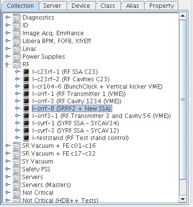

.. |br| raw:: html

    

.. |clearfloat|  raw:: html

    

Displaying collection
*********************

|clearfloat|

It is possible to display the servers tree organized as host collection (Astor view). To enable this, you can use the -p option (see command line options).
To configure host collection, you have to follow the Astor congiduation process and to confugure Starter properties.

|clearfloat|

