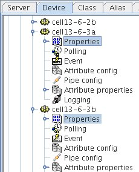
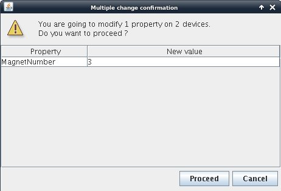

.. |br| raw:: html

    

.. |clearfloat|  raw:: html

    

Advanced Editing
****************

Multiple Editing
================

You can select several property nodes by holding the CTRL key down. Then if you edit one or more properties, all properties will be affected in all selected nodes. If several nodes are selected a confirmation dialog will appear as shown below.

|clearfloat|

Multiple Selection
==================

.. figure:: edit_select.jpg
   :align:   left

You can by rigth clicking on a domain or family node select a type of node to select. Then a dialog will ask you which class you want to select. All classes present in the tree under the selection root will be selectable as shown below.

|clearfloat|

.. figure:: edit_list.jpg
   :align:   center

Multiple Selection in a table
=============================

.. figure:: edit_table_menu.jpg
   :align:   left

You can select multiple properties by using a filter. Select "Multiple selection" from the tools menu to display the multiple selection table.

|clearfloat|

.. figure:: edit_table.jpg
   :align:   center

- Enter a selection filter using wildcard '*' to get the list of desired properties.
- You can edit a single propery in the talbe or Apply a global value to all the selection by clicking on the "Apply to all" button. "Apply to all" will first ask for the value to be applied.

