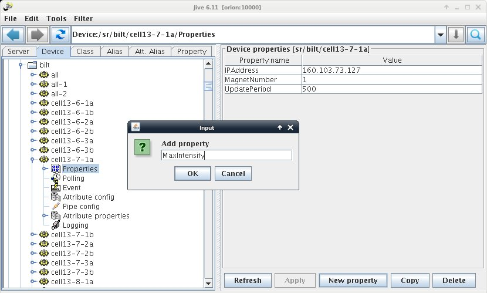
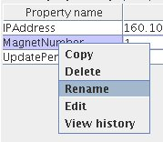
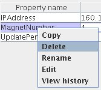
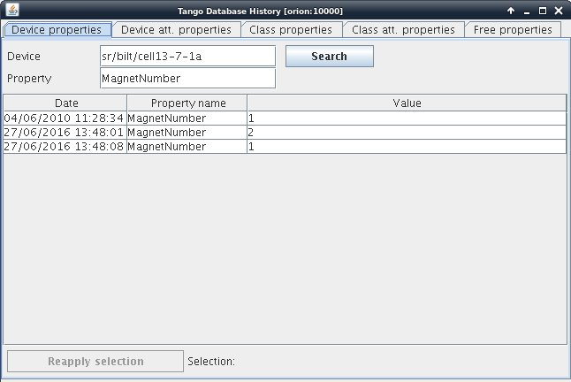

.. |br| raw:: html

    

.. |clearfloat|  raw:: html

    

Manage Properties
*****************

Creating a Property
===================

Go in the device tree and select the Properties node, then click on the "New property" button. This will prompt an input dialog where you can enter the property name.

Rename a Property
=================

Rigth click on the property name in the property table and select "Rename", This will allow you to give a new name to your property.

|clearfloat|

Delete a Property
=================

You can select "Delete" (right click on the property item) to remove one propery. You can also right click on the device node and select "Delete". This will erase all properties (including attribute properties) for the device. Note that if you want to remove the device itself, you have to remove it from its class in the server definition.

|clearfloat|

History of a Property
=====================

.. figure:: property_history.jpg
   :align:   left

You can access to the change history of a property by selecting "View History". This opens the history dialog.

|clearfloat|

   **Tango Database History dialog**

