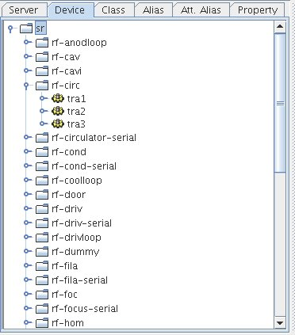

.. |br| raw:: html

    

.. |clearfloat|  raw:: html

    

Filtering the nodes in trees
****************************

.. figure:: filter_menu.jpg
   :align:   left

It is possible to filter some nodes in selection trees. Select which tree you want to be filtered then enter a filter (using wildcard) in the input dialog.

|clearfloat|

Then the device tree will be displayed as below:

